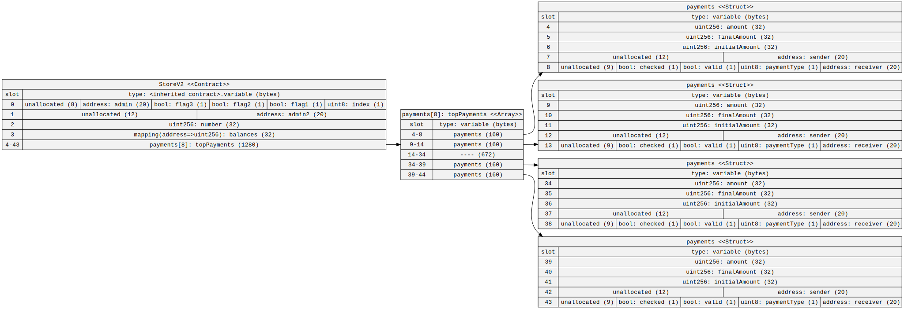

## Homework 4

## Optimising Storage

Take this [contract](https://gist.github.com/extropyCoder/6e9b5d5497b8ead54590e72382cdca24)

Use the [sol2uml](https://github.com/naddison36/sol2uml) tool to find out how many storage slots it is using.

By re ordering the variables, can you reduce the number of storage slots needed?

### Install sol2uml

The following installation assumes [Node.js](https://nodejs.org/en/download/) has already been installed which comes with [Node Package Manager (NPM)](https://www.npmjs.com/).
`sol2uml` works with node 14 or above.

To install globally so you can run `sol2uml` from anywhere

```bash
npm link sol2uml --only=production
```

To upgrade run

```bash
npm upgrade sol2uml -g
```

To see which version you are using

```bash
npm ls sol2uml -g
```

### Usage

To see contracts basic storage:

```
sol2uml storage ./src -c Store
```

svg file with storage diagram is generated


See [commands and options](https://github.com/naddison36/sol2uml/blob/master/README.md#usage)

See exmaple to run [here](https://github.com/naddison36/sol2uml/blob/master/examples/storage/README.md)

### Optimizations

#### [Store.sol](./src/Store.sol)

- 60 memory slots used


#### [StoreV2.sol](./src/StoreV2.sol)

- 43 memory slots used


